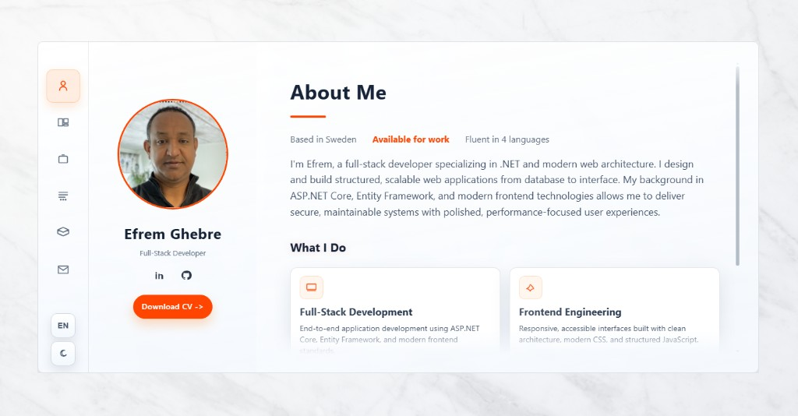

<p align="center">
  
  
  
  
</p>

# Efrem Ghebre - Portfolio

Modern, single-page developer portfolio built with Eleventy, Nunjucks, and
vanilla HTML/CSS/JS. The layout uses a fixed rail navigation, profile card,
and animated content panel system with build-time data sources.

## Highlights

- Sliding panel navigation with smooth transitions
- Dark/light theme toggle and EN/SV language toggle
- Build-time GitHub repo data via Eleventy data files
- Education and work experience sourced from JSON
- Accessible, keyboard-friendly navigation and semantics
- Modular templates and split CSS for maintainability
- Responsive behavior for tablet and mobile breakpoints

## Latest Updates

- Responsive optimization for:
  - Desktop: `1024px+` (desktop layout preserved)
  - Tablet: `768px-1023px`
  - Mobile: `<768px`
- Mobile top-bar behavior for navigation controls and toggles
- Updated project screenshots in `src/assets/projects/`
- Live app links added in Projects:
  - VibeMix: [https://vibemix.app/](https://vibemix.app/)
  - Nest: [https://your-nest.vercel.app/](https://your-nest.vercel.app/)

## Tech Stack

- Eleventy (11ty) + Nunjucks templates
- Vanilla HTML, CSS, and JavaScript
- Node.js for build tooling

## Project Structure

- `src/` source templates, data, and assets
- `src/_includes/` reusable Nunjucks partials
- `src/_data/` build-time data sources (GitHub + resume)
- `src/styles/` split CSS (base, layout, components, responsive)
- `dist/` build output (generated)

## Quick Start

```bash
npm install
npm run dev
```

Production build:

```bash
npm run build
```

Optional `.env` (recommended for higher GitHub API limits):

```env
GITHUB_TOKEN=your_token_here
```

## Notes

- All edits should be made in `src/` (not `dist/`).
- `src/index.html` is the single source template. `dist/index.html` is generated.
- CSS entry point is `src/style.css`, which imports split files from
  `src/styles/`.

## Screenshot


