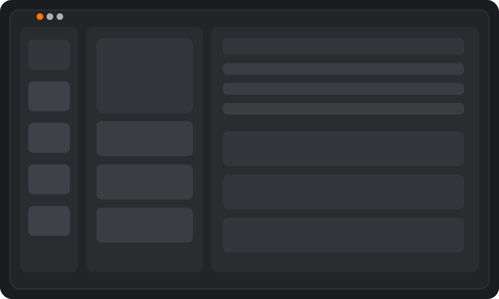

<p align="center">
  
</p>

<p align="center">
  
  
  
  
</p>

# Efrem Ghebre - Portfolio

Modern, single-page developer portfolio built with Eleventy, Nunjucks, and
vanilla HTML/CSS/JS. The layout uses a fixed rail, profile card, and a sliding
content panel system, with data-driven sections sourced at build time.

## Highlights

- Sliding panel navigation with smooth transitions
- Build-time GitHub repo data via Eleventy data files
- Education and work experience sourced from JSON
- Accessible, keyboard-friendly navigation and semantics
- Modular templates and split CSS for maintainability

## Tech Stack

- Eleventy (11ty) + Nunjucks templates
- Vanilla HTML, CSS, and JavaScript
- Node.js for build tooling

## Project Structure

- `src/` source templates, data, and assets
- `src/_includes/` reusable Nunjucks partials
- `src/_data/` build-time data sources (GitHub + resume)
- `src/styles/` split CSS (base, layout, components, responsive)
- `dist/` build output (generated)

## Getting Started

Install dependencies:

```
npm install
```

Run the dev server:

```
npm run dev
```

Build for production:

```
npm run build
```

## Environment Variables

GitHub API calls can be authenticated to avoid rate limits. Create a `.env`
file in the project root:

```
GITHUB_TOKEN=your_token_here
```

## Notes

- All edits should be made in `src/` (not `dist/`).
- `src/index.html` is the single source template. `dist/index.html` is generated.
- CSS entry point is `src/style.css`, which imports split files from
  `src/styles/`.

## Screenshot


